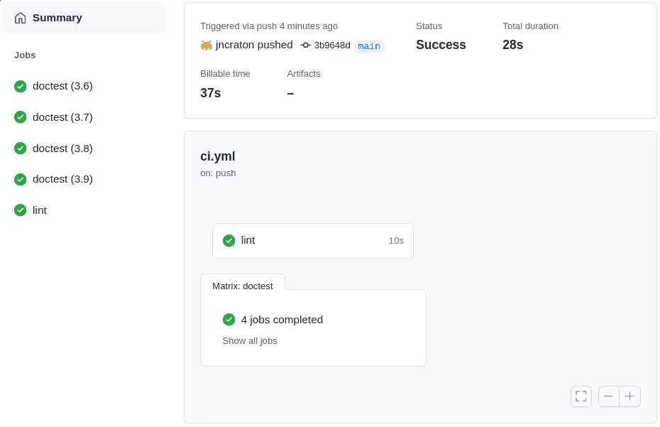

Github Actions Declarative Configuration
========================================

This project explores configuring a continuous integration workflow using [Github Actions](https://github.com/features/actions).

Modify `.github/workflows/ci.yml` such that it runs the following jobs on each commit:

1. `lint` job - Run `flake8 main.py` against Python 3.5
    - `main.py` requires access to the `markdown` module, which is not installed by default. We need to ensure that it is installed (`pip3 install -r requirements.txt`) before we run the doctests.
   - For the lint task only, we need flake8 installed (`pip3 install flake8`) in addition to the modules specified in `requirements.txt`.
2. `doctest` jobs - Run `python3 -m doctest main.py` for each of Python 3.6, 3.7, 3.8, and 3.9.
 
Once the integration test workflows are implemented, the output of a workflow on the actions tab should look like this:

